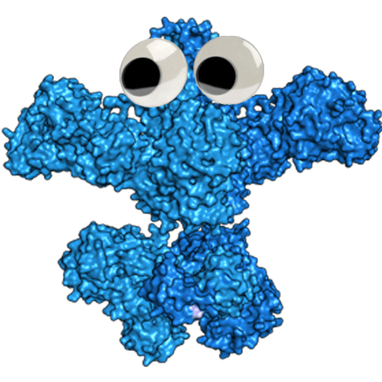

# Foldy

<p align="center">
  Foldy is a webtool for doing computational structural biology, centered around protein structure prediction with AlphaFold.
</p>
<p align="center">
  
</p>

## Table of Contents

- [Foldy](#foldy)
  - [Table of Contents](#table-of-contents)
  - [Local Deployment](#local-deployment)
    - [Initial setup](#initial-setup)
    - [For live development](#for-live-development)
    - [Upgrading Database in development](#upgrading-database-in-development)
    - [Development Tasks](#development-tasks)
  - [Production Deployment](#production-deployment)
    - [Initial Setup](#initial-setup-1)
    - [Deploying new code](#deploying-new-code)
  - [Acknowledgements](#acknowledgements)
  - [Code License](#code-license)

## Local Deployment

Local development is supported with [docker compose](https://docs.docker.com/compose/).

### Initial setup

1. Check that AlphaFold will be able to use a GPU by running:
1. Install docker which includes docker-compose [[installation instructions]](https://docs.docker.com/engine/install/)
1. Clone this repository:

   ```bash
   git clone https://github.com/JBEI/foldy.git
   cd foldy
   ```

1. Install frontend dependencies and backend dependencies with [[conda]](https://docs.conda.io/en/latest/miniconda.html)

   ```bash
   conda create -y -n foldy-environment
   conda activate foldy-environment
   conda install -c conda-forge nodejs==16.17.1 python==3.7.13
   pip install -r backend/requirements.txt
   cd frontend
   npm install
   ```

1. Copy the secrets env file `cp secrets_template.env secrets.env`
   - Note, the secrets.env file will hold the following credentials and should never be exposed publicly:
     - `GOOGLE_CLIENT_ID`: OAuth Client ID used to enable Google authentication for Foldy users
     - `GOOGLE_CLIENT_SECRET`: OAuth Client Secret used to enable Google authentication for Foldy users
     - `EMAIL_USERNAME`: Email account username used for application notifications
     - `EMAIL_PASSWORD`: Email account password used for application notifications
   - To create OAuth Client ID for development, using the [Google cloud console](https://console.cloud.google.com/apis/credentials).
     - Authorized javascript origins: `http://localhost:8080`
     - Authorized redirect URIs: `http://localhost:8080/api/authorize`
     - Then paste the ID and secret in the `GOOGLE_CLIENT_{ID,SECRET}` fields in `secrets.env`
1. Start the backend in a new terminal window.
   - From the root of the foldy repo, call `docker-compose up`
1. Create the DBs in the local postgres instance
   - From the root of the foldy repo: `docker-compose exec backend flask db upgrade`

### For live development

Changes to both the frontend and backend will be live-reloaded.

1. Start the backend in a new terminal window.
   - From the root of the foldy repo, call `docker-compose up`
1. Start the frontend in a new terminal window
   - From the `frontend` directory: `npm start`
1. Visit `localhost:3000` in your browser.

### Upgrading Database in development

If any changes are made to the database models, execute the following commands to create a revision and migrate database

```bash
docker-compose exec backend flask db stamp $CURRENT_REVISION_NUMBER
docker-compose exec backend flask db migrate
docker-compose exec backend flask db upgrade
```

### Development Tasks

TODO: Protein structure prediction tasks in the development environment are not actually performed.
Instead a few test cases have been precomputed that auto-complete once queued.

---

## Production Deployment

Once you are satisfied with the application, you can deploy the application into production by
following the procedure below.

### Initial Setup

This site is built on Kubernetes (specifically [Google Kubernetes Engine, GKE](https://cloud.google.com/kubernetes-engine)).
A few Google Cloud resources need to be created, included a GKE project, and then all
resources within GKE can be deployed at once. The Kuberenetes config, and its resources,
are expressed using a tool called Helm.

Prior to deployment, you must choose the following variables:

- `GOOGLE_PROJECT_ID`: ID for institution google cloud project. Does not need to be foldy specific. Can be retrieved from google cloud console.
- `GKE_CLUSTER_NAME`: Name of kubernetes foldy cluster, typically 'foldy'
- `GOOGLE_SERVICE_ACCOUNT_ID`: Name of service account that foldy uses, typically 'foldy-sa'
- `GOOGLE_SQL_DB_NAME`: Name of SQL database in gke cluster, typically 'foldy-db'
- `GOOGLE_SQL_DB_PASSWORD`: SQL database password in gke cluster, for example use the following command to generate a secure password:

  ```bash
  python -c 'import secrets; print(secrets.token_urlsafe(32))'
  ```

- `FOLDY_DOMAIN`: Domain name selected for foldy application
- `FOLDY_USER_EMAIL_DOMAIN`: Email domain to allow access, e.g. "lbl.gov" will allow all users with "@lbl.gov" email addresses to access
- `GOOGLE_BUCKET_NAME`: Name of google cloud bucket, for example 'berkeley-foldy-bucket' however it needs to be unique globally like an email address needs to be unique globally
- `GOOGLE_ARTIFACT_REPO`: Name of google cloud docker image repository, typically 'foldy-repo'
- `GOOGLE_CLOUD_STATIC_IP_NAME`: Name of google cloud static IP resource, typically 'foldy-ip'

These variables will be used throughout this procedure. Once completed, execute the following procedure:

1. Clone this repo

   ```bash
   git clone --recurse-submodules https://github.com/JBEI/foldy.git
   cd foldy
   ```

1. Copy the following templates:

   ```bash
   cp foldy/values_template.yaml foldy/values.yaml
   cp frontend/.env_template.production frontend/.env.production
   cp db_creation_resources_template.yaml db_creation_resources.yaml
   ```

1. Choose a domain! We named our instance `LBL foldy`, and reserved the domain `foldy.lbl.gov` with our IT folks, and we think it reads pretty well. If you don't have an IT team who can provision a domain name / record for you, you can reserve an address like _ourinstitute_-foldy.com using any commercial hostname provider
1. Enable cloud logging API [for prometheus / metrics](https://cloud.google.com/logging/docs/api/enable-api)
1. Install local tools `gcloud`, `helm`, and `kubectl`:
   1. Install Google Cloud CLI [[instructions here](https://cloud.google.com/sdk/docs/install-sdk)]
   2. Install Helm CLI [[instructions here](https://helm.sh/docs/intro/install/)], briefly `brew install helm`
   3. Install Kubectl CLI [[instructions here]](https://cloud.google.com/kubernetes-engine/docs/how-to/cluster-access-for-kubectl#install_kubectl)). Briefly, make sure you call `gcloud components install kubectl` and `gcloud components install gke-gcloud-auth-plugin`
1. Create following google cloud resources

   - **Create foldy service account** which has scopes/permissions to access necessary foldy resources
     - From [google cloud console](https://cloud.google.com/iam/docs/creating-managing-service-accounts#creating).
     - Make sure to provide following roles:
       - artifact registry administrator
       - artifact registry reader
       - cloud sql client
       - compute admin
       - logging admin
       - monitoring admin
       - storage admin
       - storage object admin
     - Fill in service account details in `cluster_config.yaml`
   - **Create Kubernetes project**

     ```bash
     gcloud container clusters create $GKE_CLUSTER_NAME --enable-managed-prometheus --region=us-central1-c --workload-pool=$GOOGLE_PROJECT_ID.svc.id.goog
     ```

   - **Enable kubectl**

     ```bash
     gcloud container clusters get-credentials $GKE_CLUSTER_NAME
     ```

   - **Create PostgreSQL DB**:

     ```bash
     gcloud sql instances create ${GOOGLE_SQL_DB_NAME} --tier=db-f1-micro --region=us-central1 --storage-size=100GB --database-version=POSTGRES_13 --root-password=${GOOGLE_SQL_DB_PASSWORD}
     ```

     - Then, through the cloud console, enable private IP at `https://console.cloud.google.com/sql/instances/${GOOGLE_SQL_DB_NAME}`, and note the DB IP address as `GOOGLE_SQL_DB_PRIVATE_IP`
     - Now, fill in `DATABASE_URL` in `foldy/values.yaml` using following example: `postgresql://postgres:${GOOGLE_SQL_DB_PASSWORD}@${GOOGLE_SQL_DB_PRIVATE_IP}/postgres`

   - **Allocate Static IP Address**

     - From the [Cloud Console](https://console.cloud.google.com/networking/addresses/list), reserve an external static IP address
     - Make it IPv4, Regional (us-central1, attached to None)

     ```bash
     gcloud compute addresses create ${GOOGLE_CLOUD_STATIC_IP_NAME} --global
     gcloud compute addresses describe ${GOOGLE_CLOUD_STATIC_IP_NAME} --global
     ```

   - **OAuth Client ID**
     - Create OAuth Client ID for production
       - Using the [Google cloud console](https://console.cloud.google.com/apis/credentials).
       - Application type: Web Application
       - Name: `${GKE_CLUSTER_NAME}-prod`
       - Authorized javascript origins: `https://${FOLDY_DOMAIN}`
       - Authorized redirect URIs: `https://${FOLDY_DOMAIN}/api/authorize`
       - Then paste the ID and secret in the `GOOGLE_CLIENT_{ID,SECRET}` fields in `foldy/values.yaml`
   - **Create gcloud bucket** using [cloud console](https://cloud.google.com/storage/docs/creating-buckets) with following attributes:
     - Name = `${GOOGLE_BUCKET_NAME}`
     - Multi-region
     - Autoclass storage class
     - Prevent public access
     - No object protection
   - **Create gcloud docker image repo** by running:

     ```bash
     gcloud artifacts repositories create ${GOOGLE_ARTIFACT_REPO} --repository-format=docker --location=us-central1
     ```

   - **Enable permission to push and pull images** from artifact registry with:

     ```bash
     gcloud auth configure-docker us-central1-docker.pkg.dev
     ```

   - **Create node pools** by running:

     ```bash
     bash scripts/create_nodepools.sh ${GKE_CLUSTER_NAME} ${GOOGLE_SERVICE_ACCOUNT_ID}@${GOOGLE_PROJECT_ID}.iam.gserviceaccount.com
     ```

1. Fill out template files

   - Fill in `SECRET_KEY` in `foldy/values.yaml` with random secure string, for example use the following command

   ```bash
   python -c 'import secrets; print(secrets.token_urlsafe(32))'
   ```

   - `EMAIL_USERNAME` and `EMAIL_PASSWORD` in `foldy/values.yaml` are optional. They will be used for status notifications, but they must be gmail credentials if specified.
   - Fill in variables in `foldy/values.yaml` with appropriate values

1. Install the Keda helm/kubernetes plugin [with docs](https://keda.sh/docs/2.9/deploy/)

1. Bind service account to GKE

   ```bash
   gcloud iam service-accounts add-iam-policy-binding ${GOOGLE_SERVICE_ACCOUNT_ID}@${GOOGLE_PROJECT_ID}.iam.gserviceaccount.com --role roles/iam.workloadIdentityUser --member "serviceAccount:${GOOGLE_PROJECT_ID}.svc.id.goog[default/foldy-ksa]"
   ```

1. Build and push docker images to your google artifact registry with

   ```bash
   bash build_and_deploy_containers.sh ${GOOGLE_PROJECT_ID} v1
   ```

1. Make sure that the `ImageVersion` is properly set in `foldy/values.yaml`, then deploy the kubernetes services using

   ```bash
   helm install foldy foldy
   ```

1. Initialize tables in PostgreSQL database

   ```bash
   kubectl exec service/backend -- env FLASK_APP=main.py flask db upgrade
   ```

1. Fill out `db_creation_resources.yaml` with appropriate variables and download alphafold databases into a persistent volume with

   ```bash
   kubectl apply -f db_creation_resources.yaml
   ```

   Can monitor progress of database download with

   ```bash
   kubectl logs --follow --timestamps --previous create-dbs |less
   ```

   **Note, don't run any jobs until database download has been completed.**

1. Reserve a domain name

   - Can use this command to find static IP address

   ```bash
   gcloud compute addresses describe ${GOOGLE_CLOUD_STATIC_IP_NAME} --global
   ```

   - You can add an ANAME record pointing at the static IP address provisioned above.

_Note, using the `us-central1-c` region is required because most google A100s are located in that region._

### Deploying new code

1. Increment `ImageVersion` in `foldy/values.yaml`
1. Rebuild the docker images:

   ```bash
   ./build_and_deploy_containers.sh ${PROJECT_ID} ${GOOGLE_ARTIFACT_REPO} ${IMAGE_VERSION}
   ```

1. Update the helm chart `helm upgrade foldy foldy`

## Acknowledgements

Foldy utilizes many separate libraries and packages including:

- [Alphafold](https://github.com/deepmind/alphafold)
- [Autodock Vina](https://vina.scripps.edu/)
- [AntiSMASH](https://github.com/antismash/antismash)
- [Pfam](https://www.ebi.ac.uk/interpro/)
- [NGL Viewer](https://nglviewer.org)
- [HMMER Suite](http://eddylab.org/software/hmmer)
- [Flask](https://flask.palletsprojects.com/en/2.2.x/)
- [DNA Chisel](https://github.com/Edinburgh-Genome-Foundry/DnaChisel)
- [Plotly](https://github.com/plotly/plotly.js)

We thank all their contributors and maintainers!

Use of the third-party software, libraries or code Foldy may be governed by separate terms and conditions or license provisions. Your use of the third-party software, libraries or code is subject to any such terms and you should check that you can comply with any applicable restrictions or terms and conditions before use.

## Code License

Licensed under the Apache License, Version 2.0 (the "License"); you may not use this file except in compliance with the License. You may obtain a copy of the License at <https://www.apache.org/licenses/LICENSE-2.0>.

Unless required by applicable law or agreed to in writing, software distributed under the License is distributed on an "AS IS" BASIS, WITHOUT WARRANTIES OR CONDITIONS OF ANY KIND, either express or implied. See the License for the specific language governing permissions and limitations under the License.
