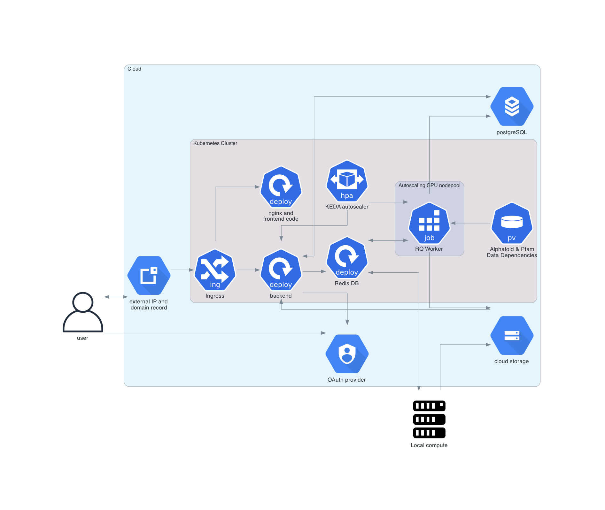

# Deployment Architecture

This document describes the Helm deployment architecture, but the other deployment models have many of the same components.

The Helm deployment of the Foldy website is a cloud based single page application deployed to Kubernetes, with autoscaling pools of compute workers. We discuss the function and interplay of the different components below, as a resource to administrators who wish to set up an instance of Foldy themselves. Some components are “cloud native,” meaning they are not a part of Kubernetes, and must be provisioned and managed manually. The rest are managed by Helm, a tool for managing large Kubernetes applications.  Note that while many cloud providers have a Kubernetes service, some configuration and some code is dependent on Google Cloud.

The last section discusses the use of local- and cluster-compute resources for predicting structures and other tasks.

> The larger blue region indicates resources run on the cloud provider, and further instructions will assume this is run on Google Cloud. The smaller purple region denotes the Kubernetes cluster, and all resources within are created and managed by Helm. Local compute, outside the blue region, denotes the option to utilize cluster compute or local machines to do the compute tasks, like building MSAs for AlphaFold or running AutoDock Vina.

## Cloud Native Components

### External IP address & domain record
All user traffic into Foldy enters through a single static IP address, which is used by the Kubernetes Ingress.

For the Foldy instance to be accessible by URL, there must be a CNAME record pointing to the static IP address either within Google Cloud or the hostname provider for public URLs (such as “myinstitutefoldy.com”), or through the institute’s IT team for institutional URLs (such as “foldy.myinstitute.edu”).

### PostgreSQL database
The Postgres database has a few tables, keeping track of users, folds, docking runs, and “invocations.” The user table has email addresses. The folds table has name, sequence, user, time of creation, and AlphaFold settings. The docking runs table has ligand name, ligand SMILES, receptor ID (a fold ID), information about a bounding box, link to an invocation, and the energy of the pose. The invocation table has a fold ID, a general “type” of invocation, the state of the run (either “queued,” “running,” “finished,” or “failed”), the time it took to run, and logs.

The database has a private IP address, allowing direct access from any machine within the cloud VPN.

### OAuth provider
All Foldy users are authenticated with a cloud IAM provider, and authorized by some logic within the site. Any user with a Google email address can be authenticated. There are two types of users: editors and viewers, and the user's email address is checked against a few command line flags to determine if they have edit privileges. Editors have full access to view, edit, and create folds and associated resources. Viewers only have permission to view folds explicitly marked "public", and have no write access.

### Cloud Storage
All AlphaFold outputs for every fold, as well as outputs of other tools, are stored in a single gcloud bucket, indexed by fold ID.

### Kubernetes Engine
Most services are run within Google Kubernetes Engine (GKE).

## Helm-managed Kubernetes Resources
Every resource within Kubernetes is managed in the single “foldy/manifest.yaml” file. The important components include:
* frontend: a compiled React app is served by an nginx docker container in the frontend deployment
* backend: a single flask application serves all user and structure data, and puts jobs on the RedisQueue
* redisqueue: a Redis instance tracks multiple job queues, where jobs are separated by the necessary hardware, including:
  
  Queue | Jobs | Hardware
  --- | --- | ---
  emailparrot | Jobs requiring a tiny machine, such as sending an email | Minimal amount of CPU
  cpu | Jobs that require CPU and not GPU, such as when running Pfam or building multiple sequence alignments | 60GB RAM, 6 CPU
  gpu | Jobs that require moderate GPU, such as as solving a structure with a few hundred amino acids | Small GPU, such as NVIDIA Tesla K80
  biggpu | Jobs that require a large amount of GPU, such as structures with more than a few hundred amino acids | Big GPU, such as NVIDIA A100 with 80GB memory
* KEDA autoscaler: a Kubernetes Event Driven Autoscaler (KEDA) instance monitors the number of jobs in each job queue via metrics collected by the GKE Managed Prometheus Instance, via a Prometheus frontend, and scales up or down the number of worker threads in a few worker pools
* RQ Worker: one RedisQueue worker is executed per job on the RedisQueue, and it is run in a Kubernetes Job. The node for the worker is selected based on the specific queue
* AlphaFold & pfam data dependencies: all data dependencies are held in a single, read-only volume claim

### Sub-tasks of a protein structure prediction task
Each new fold that is submitted is broken down into several sub-tasks:
* Features: the features sub-task performs a search of large genetic databases in order to generate a multiple sequence alignment (MSA) of the query protein sequences. This task is handled in the cpu queue.
* Models: the models sub-task performs protein structure prediction using AlphaFold given the MSA from the Features sub-task. This task is handled either in the gpu or biggpu queue depending on the size of the query protein. The threshold for a models sub-task to be sent to the biggpu queue is 900 amino acids.
* Annotate: the annotate sub-task performs sequence annotation with antiSMASH and pfam hmmscan. This task is handled in the cpu queue. 
* Decompress Pickles: the decompress pickles sub-task extracts the intermediate information in the AlphaFold model that enables contact probability calculations. The contact probability calculations are performed using the residue-residue distance probability distribution function. This task is handled in the cpu queue. 
* Furthermore, any docking tasks that are submitted get created as a sub-task of the parent fold task. Docking tasks are handled in the cpu queue. 

## Local Compute
Local resources can be enlisted as RedisQueue Workers by proxying the redis and postgres ports to local compute resources, and making new scripts akin to “worker/run_AlphaFold.sh”, “worker/run_dock.sh”, “worker/run_annotate.sh.”

