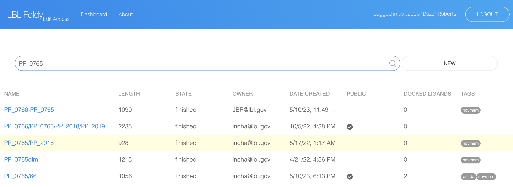
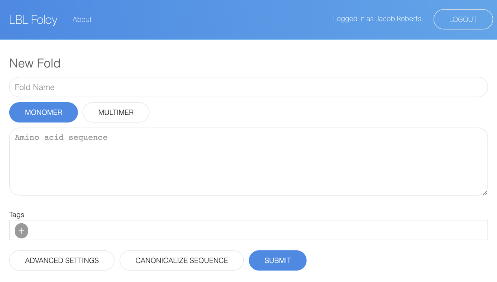
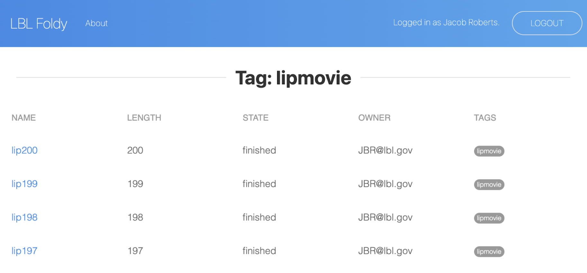
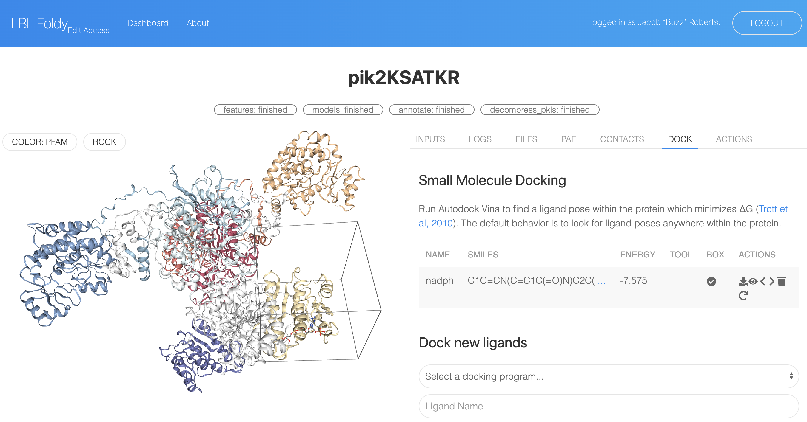
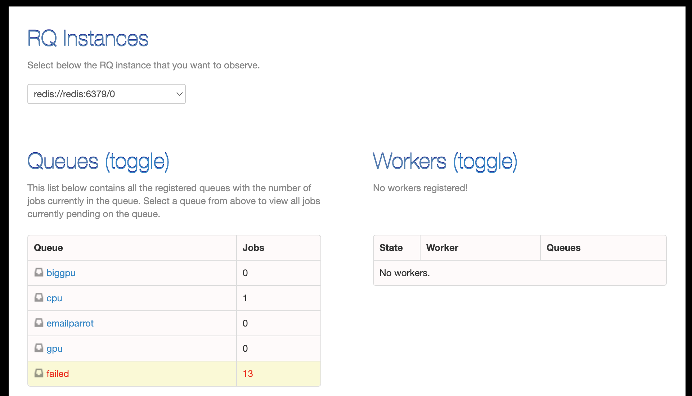
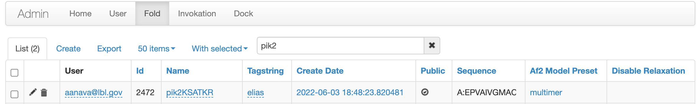
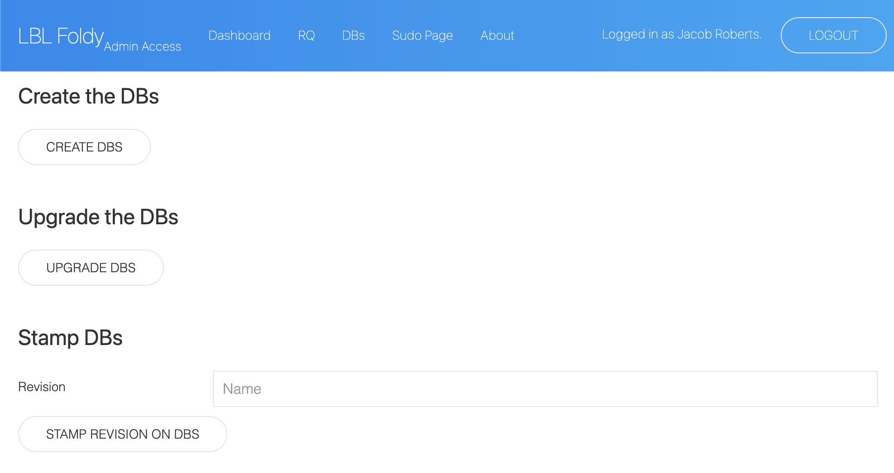

# Foldy Interface

There are four main views in the Foldy interface, and a few views accessible just to admins.

## Main Views

### Dashboard View

This is the landing page after authentication displaying a table of fold tasks. The table includes information about the status of each fold. The search bar at the top of the page enables searching and filtering folds based on their name, sequence, or tag. 

### New Fold View

This is the submission page for protein structure prediction tasks. There is a monomer mode for individual polypeptide chains and a multimer mode for more than one polypeptide chain. The canonicalize sequence tool can correct common formatting errors in pasted sequences. There are required fields to specify a protein name and amino acid sequence for each mode. Additionally, there is an optional tags field that can be specified for organizational purposes, as they can later be searched and filtered. Lastly, the advanced settings include fields to toggle bulk csv entry, delayed execution, email notifications, and amber relaxation.

### Tag View

All structures with a given tag can be viewed in the tag view. Some actions are available at the bottom of the page which apply to all folds with the Tag, including buttons to restart failed tasks, downloading results as a csv file, and bulk ligand docking.

### Structure View

The Structure view displays an example predicted structure of a homo-dimeric polyketide synthase module with the docking tool selected. Pfam domains are highlighted on the peptide structure. We docked NADPH with the docking tool, and its predicted binding affinity and pose are displayed.

#### Structure View Tools

**Structure View Toolbar Tabs.** **A. Sequence:** this tab displays the peptide sequences, optionally annotated with domain predictions, such as the pfam annotations displayed here. **B. Logging:** this tab displays real-time logs of each sub-task within a protein structure prediction task. **C. Actions:** this tab allows a user to download the top ranked pdb structure file of a given fold as well as all the intermediate files generated by the fold pipeline **D. PAE:** this tab shows the predicted alignment error heatmap, measured in Ångstroms, between each residue and between each chain. The PAE is derived from the AlphaFold model. **E. Contact Probability:** this tab shows the contact probability heatmap between each residue and between each chain. The contact probabilities are derived from the AlphaFold model. **F. Docking:** this tab shows a table with any docking results as well as a submission form for new docking tasks. The docking submission form requires a ligand name and SMILES string, and optionally a bounding box can be specified of a particular radius around a particular residue (Vina only). 

## Admin Views

### Redis Queue View

This view exposes information about the Redis Queue, which manages queued jobs. You can view which queues exist, how many jobs are on each queue, how many works are running on each queue, view logs for failed jobs, and retry failed jobs.

### Admin View

Build on Flask-Admin, this view exposes the underlying databases directly. Flask-Admin is very configurable: to change the features, modify `backend/backend/app/app.py`. Here you can correct underlying data mistakes or make changes under the hood. Very useful in development mode.

### Sudo View

Miscellany of admin related tools. The most important are the database management tools at the top - database upgrades can be done through the interface by pressing the "upgrade" button after new code has been pushed.

